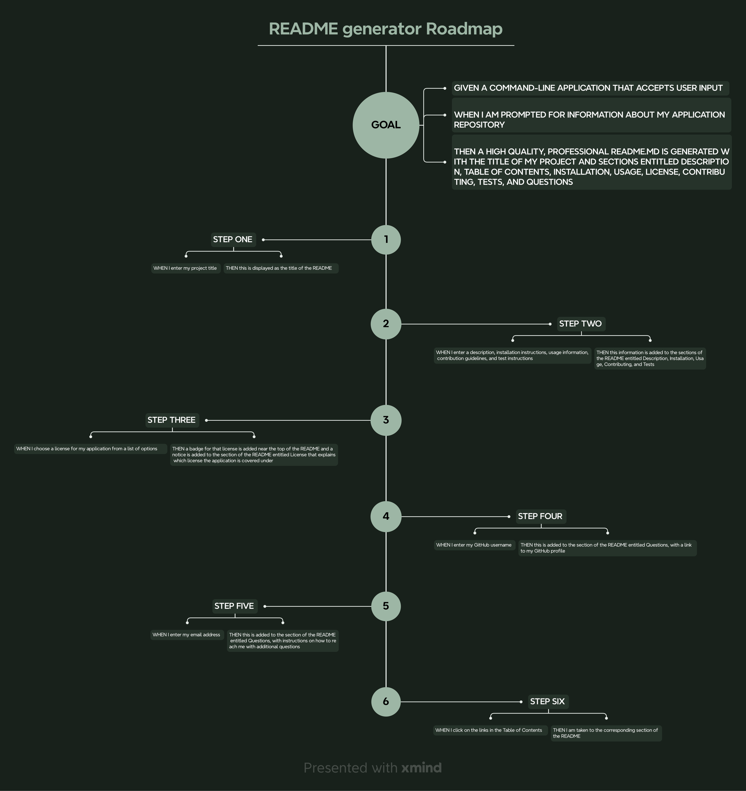

[![Contributors][contributors-shield]][contributors-url]
[![Forks][forks-shield]][forks-url]
[![Stargazers][stars-shield]][stars-url]
[![Issues][issues-shield]][issues-url]
[![MIT License][license-shield]][license-url]
[![LinkedIn][linkedin-shield]][linkedin-url]

 

  <a href="https://github.com/beckpull/readme-generator">

<h1 align="center">README Generator</h1>

  

A simple and easy-to-use professional README generator so you can focus on what's important
     
    <a href="https://github.com/beckpull/readme-generator"><strong>Explore the docs »</strong></a>
     
     
    <a href="https://drive.google.com/file/d/1gzlyNawyHbkK8rHOCyaoTeBcPb_xpLLj/view">View Demo</a>
    ·
    <a href="https://github.com/beckpull/readme-generator/issues">Report Bug</a>
    ·
    <a href="https://github.com/beckpull/readme-generator/issues">Request Feature</a>
  

<!-- TABLE OF CONTENTS -->

  
Table of Contents

  <ol>
    <li>
      <a href="#about-the-project">About The Project</a>
      <ul>
        <li><a href="#built-with">Built With</a></li>
      </ul>
    </li>
    <li><a href="#usage">Usage</a></li>
    <li><a href="#roadmap">Roadmap</a></li>
    <li><a href="#contributing">Contributing</a></li>
    <li><a href="#license">License</a></li>
    <li><a href="#contact">Contact</a></li>
  </ol>

<!-- ABOUT THE PROJECT -->
## About The Project

- This application is geared towards bootcamp students (or anybody who is creating projects from the ground up).

- The goal of this application is for users to save precious time by not having to draft a README file from scratch without compromising the quality of the produced document. 

(<a href="#readme-top">back to top</a>)

### Built With

* 
* ![NodeJS]

(<a href="#readme-top">back to top</a>)

<!-- USAGE EXAMPLES -->
## Usage

<!-- Link to video demo -->

 * Click [here](./YourREADME.md) to view an attached a sample README created using this generator. 
 * Click [here](https://drive.google.com/file/d/1gzlyNawyHbkK8rHOCyaoTeBcPb_xpLLj/view) to watch a demo video on how to use this application.

(<a href="#readme-top">back to top</a>)

<!-- ROADMAP -->
## Roadmap

<!-- GIVEN a command-line application that accepts user input
WHEN I am prompted for information about my application repository
THEN a high-quality, professional README.md is generated with the title of my project and sections entitled Description, Table of Contents, Installation, Usage, License, Contributing, Tests, and Questions
WHEN I enter my project title
THEN this is displayed as the title of the README
WHEN I enter a description, installation instructions, usage information, contribution guidelines, and test instructions
THEN this information is added to the sections of the README entitled Description, Installation, Usage, Contributing, and Tests
WHEN I choose a license for my application from a list of options
THEN a badge for that license is added near the top of the README and a notice is added to the section of the README entitled License that explains which license the application is covered under
WHEN I enter my GitHub username
THEN this is added to the section of the README entitled Questions, with a link to my GitHub profile
WHEN I enter my email address
THEN this is added to the section of the README entitled Questions, with instructions on how to reach me with additional questions
WHEN I click on the links in the Table of Contents
THEN I am taken to the corresponding section of the README -->

(<a href="#readme-top">back to top</a>)

<!-- CONTRIBUTING -->
## Contributing

Contributions are what make the open source community such an amazing place to learn, inspire, and create. Any contributions you make are **greatly appreciated**!

_If you have a suggestion that would make this better, please fork the repo and create a pull request. You can also simply open an issue with the tag "enhancement".
Don't forget to give the project a star! Thanks again!_

1. Fork the Project
2. Create your Feature Branch (`git checkout -b feature/NewFeature`)
3. Commit your Changes (`git commit -m 'Added ______ , NewFeature'`)
4. Push to the Branch (`git push origin feature/NewFeature`)
5. Open a Pull Request

See the [open issues](https://github.com/beckpull/readme-generator/issues) for a full list of proposed features (and known issues).

(<a href="#readme-top">back to top</a>)

<!-- LICENSE -->
## License

Distributed under the MIT License. See `LICENSE.txt` for more information.

(<a href="#readme-top">back to top</a>)

<!-- CONTACT -->
## Contact

**Rebecca Feltman** - [Email me](mailto:beckpull@icloud.com) - or check me out on [GitHub!](https://github.com/beckpull) 

>Repository Link: [https://github.com/beckpull/readme-generator](https://github.com/beckpull/readme-generator)

(<a href="#readme-top">back to top</a>)

<!-- ACKNOWLEDGMENTS -->
## Acknowledgments

* This README file was created by [@othneildrew](https://github.com/othneildrew) using the template found [here](https://github.com/othneildrew/Best-README-Template)
* Credit for my **table of contents drafting style** seen in lines 75 - 103 of generateMarkdown.js goes to [@connietran-dev](https://github.com/connietran-dev) - click [here](https://github.com/connietran-dev/readme-generator/blob/master/utils/generateMarkdown.js) to see what I mean 😎
* [@NathaliaReyes](https://github.com/nathaliareyes) - thank you for your continued support and helping jumpstart me into this project ✨

#### Disclaimer: 
> I utilized several articles from sources such as (but not limited to) Stack Overflow, W3Schools, and MDN Web Docs **as references** for the javascript code attached. 
>
>**All of the utilized information has been altered in order to fit this project.** 

(<a href="#readme-top">back to top</a>)

<!-- MARKDOWN LINKS & IMAGES -->
<!-- https://www.markdownguide.org/basic-syntax/#reference-style-links -->
[contributors-shield]: https://img.shields.io/github/contributors/beckpull/readme-generator.svg?style=for-the-badge
[contributors-url]: https://github.com/beckpull/readme-generator/graphs/contributors
[forks-shield]: https://img.shields.io/github/forks/beckpull/readme-generator.svg?style=for-the-badge
[forks-url]: https://github.com/beckpull/readme-generator/network/members
[stars-shield]: https://img.shields.io/github/stars/beckpull/readme-generator.svg?style=for-the-badge
[stars-url]: https://github.com/beckpull/readme-generator/stargazers
[issues-shield]: https://img.shields.io/github/issues/beckpull/readme-generator.svg?style=for-the-badge
[issues-url]: https://github.com/beckpull/readme-generator/issues
[license-shield]: https://img.shields.io/github/license/beckpull/readme-generator.svg?style=for-the-badge
[license-url]: https://github.com/beckpull/readme-generator/blob/main/LICENSE
[product-screenshot]: images/screenshot.png
[NodeJS]: https://img.shields.io/badge/node.js-6DA55F?style=for-the-badge&logo=node.js&logoColor=white
[Node-url]: https://nodejs.org/en
[JQuery.com]: https://img.shields.io/badge/jQuery-0769AD?style=for-the-badge&logo=jquery&logoColor=white
[JQuery-url]: https://jquery.com 
[Bulma]: https://img.shields.io/badge/bulma-00D0B1?style=for-the-badge&logo=bulma&logoColor=white
[linkedin-shield]: https://img.shields.io/badge/-LinkedIn-black.svg?style=for-the-badge&logo=linkedin&colorB=555
[linkedin-url]: https://www.linkedin.com/in/rebecca-feltman-70555321a/
